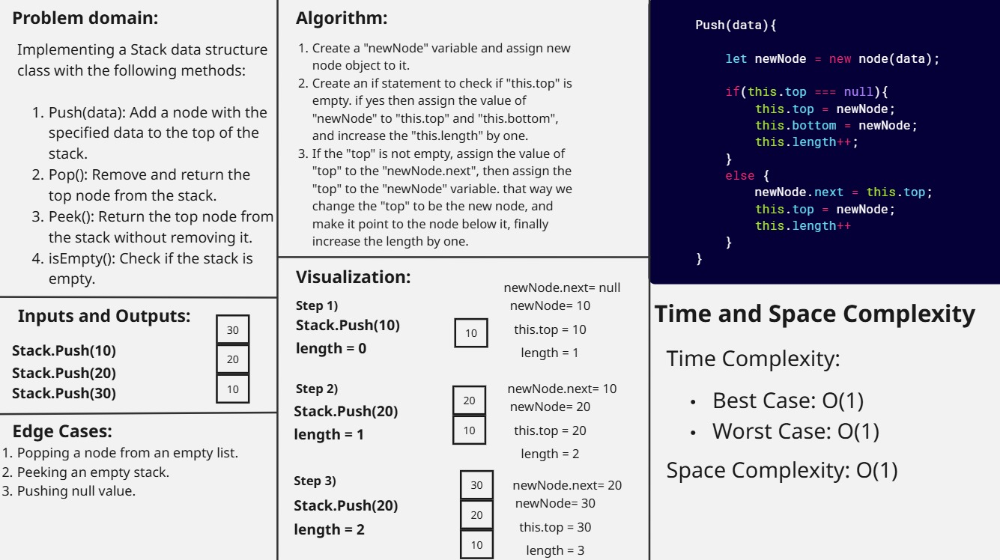
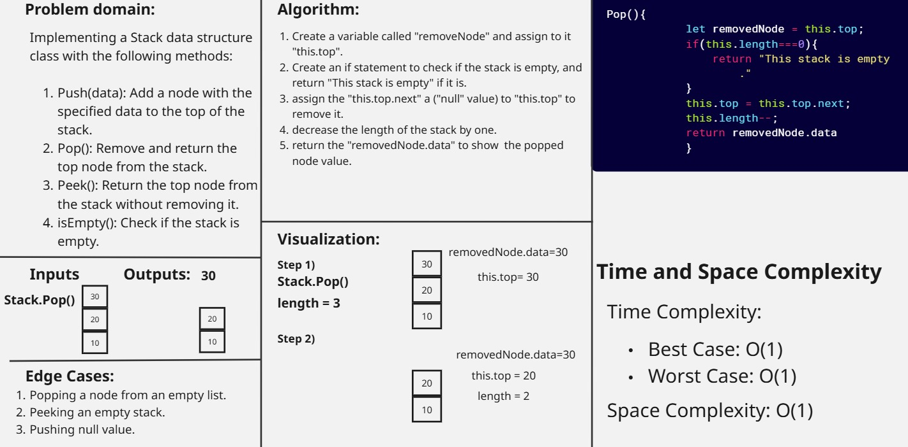
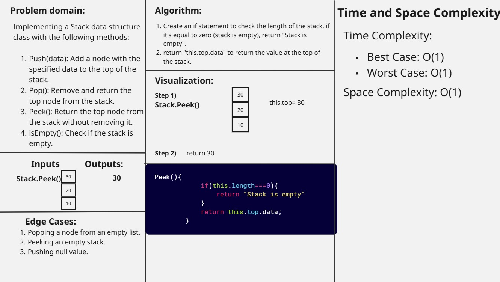
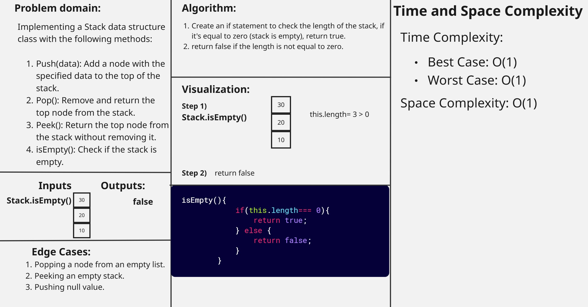
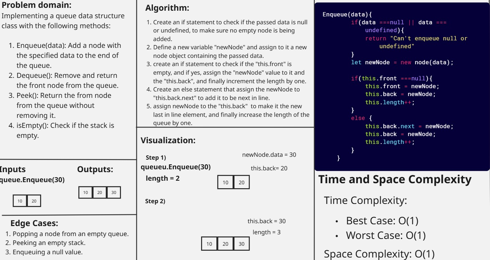
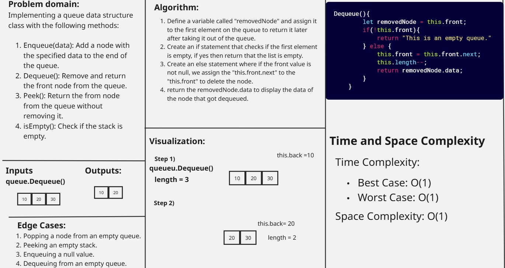
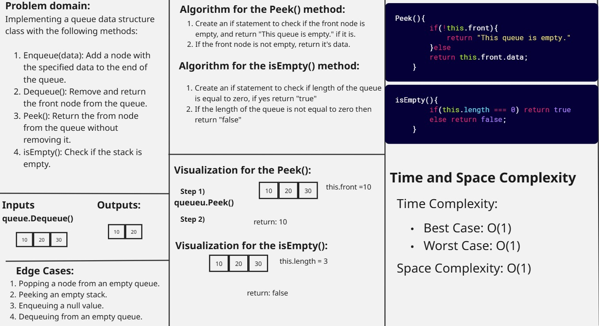

### Stack: Push(data) method

### Stack: Pop() method

### Stack: Peek() method

### Stack: isEmpty() method

### Queue: Enqueue(data) method

### Queue: Dequeue() method

### Queue: Peek() and isEmpty() methods

