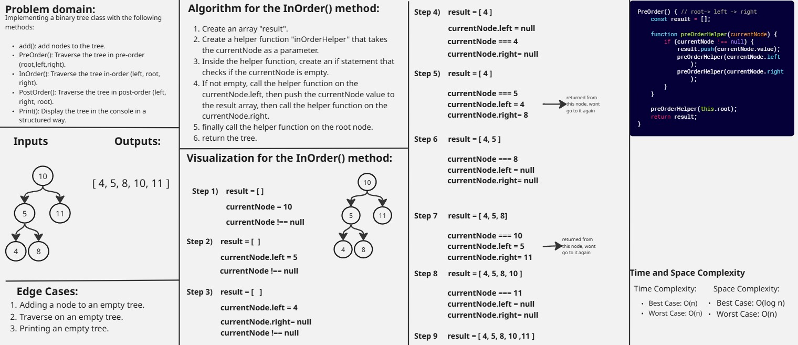
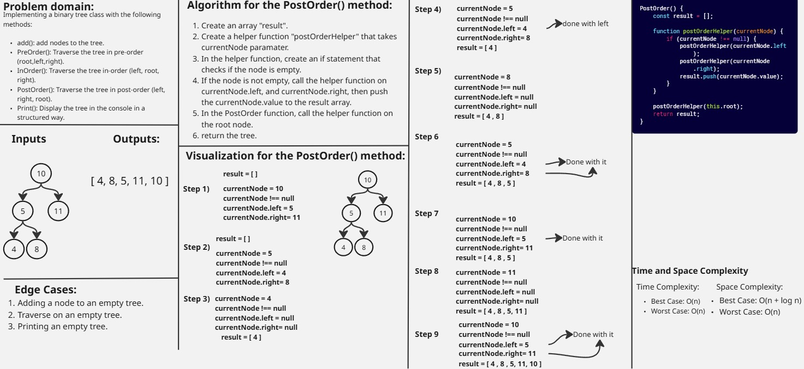
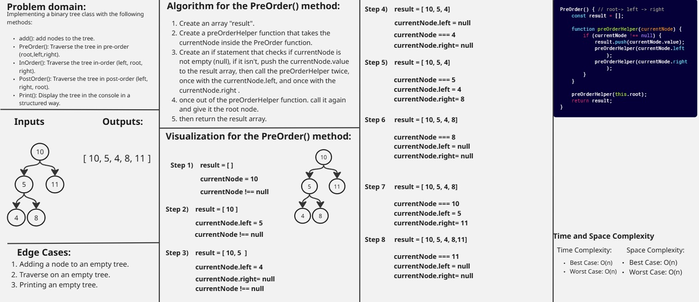
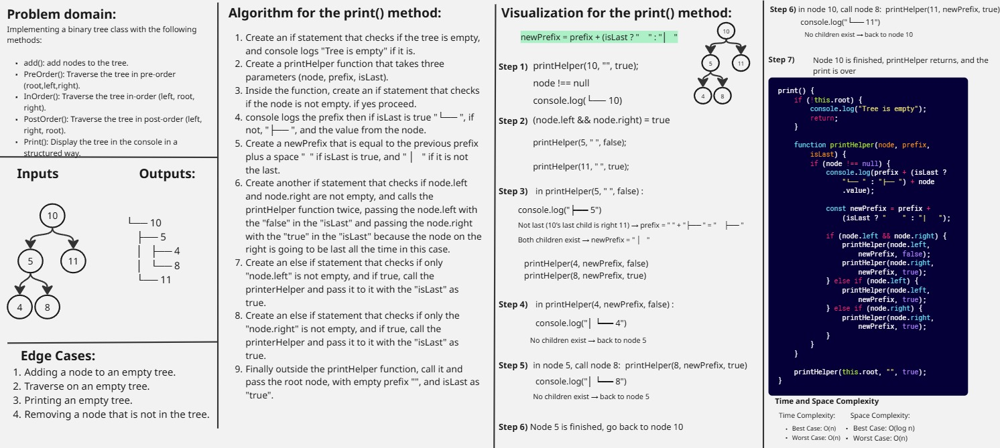
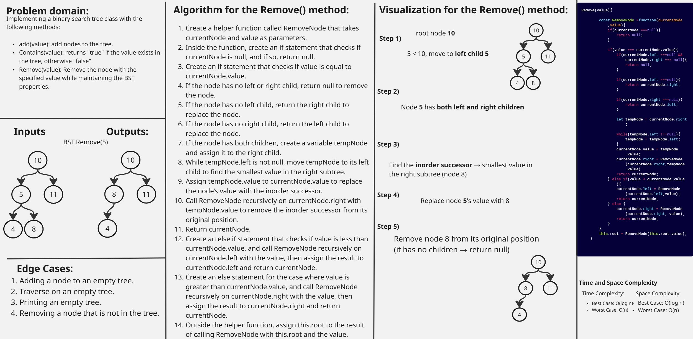

### Binary-Tree: add() method whiteboard

.jpg)

### Binary-Tree: inOrder() method whiteboard

### Binary-Tree: PostOrder() method whiteboard

### Binary-Tree: PreOrder() method whiteboard

### Binary-Tree: print() method whiteboard

### Binary-Search-Tree: add() method whiteboard

.jpg)

### Binary-Search-Tree: Contains() method whiteboard

.jpg)

### Binary-Search-Tree: Remove() method whiteboard

### Binary Search Tree and Binary Tree Output whiteboard

