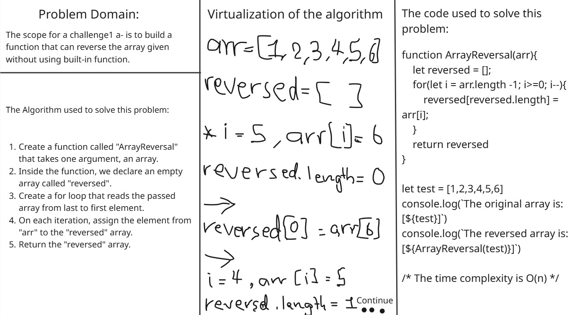
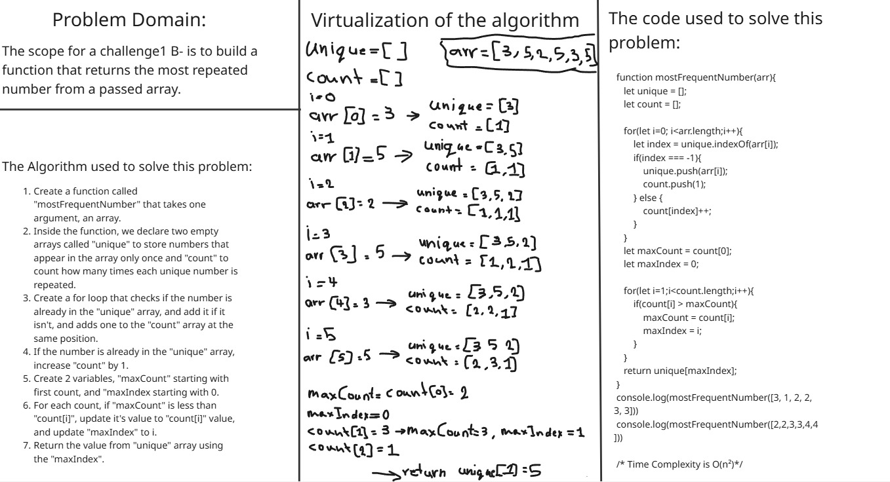
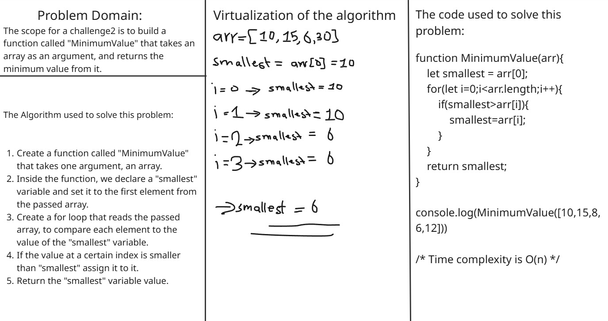
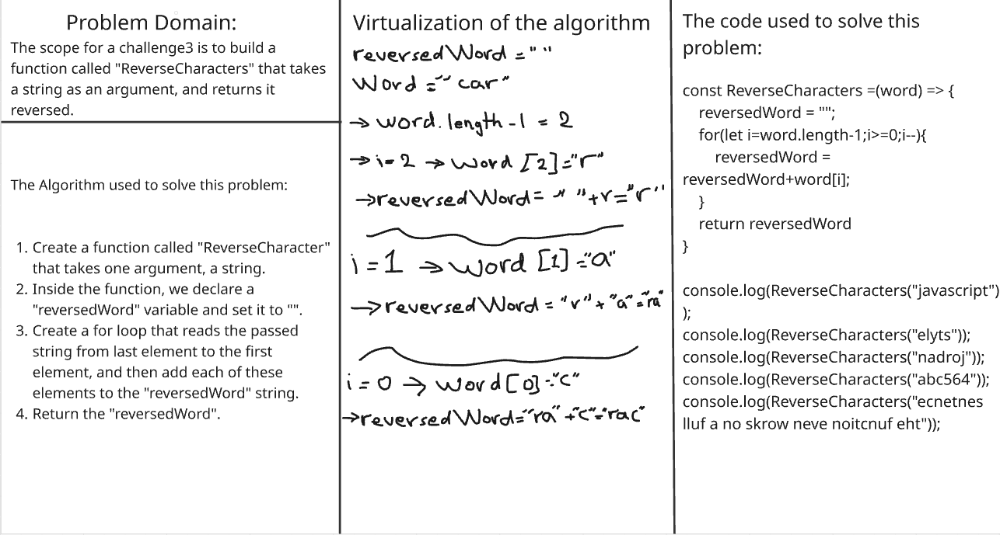
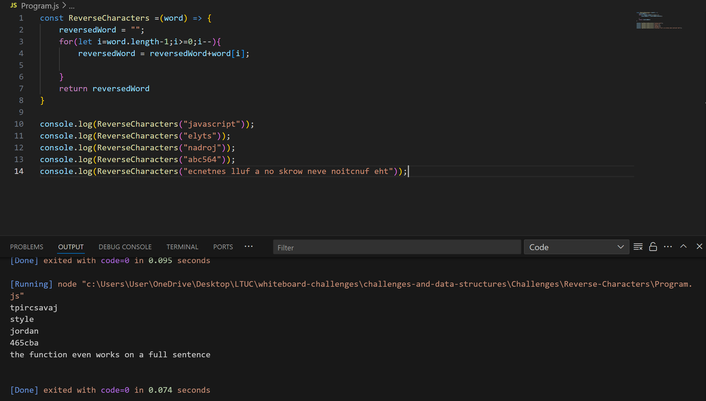
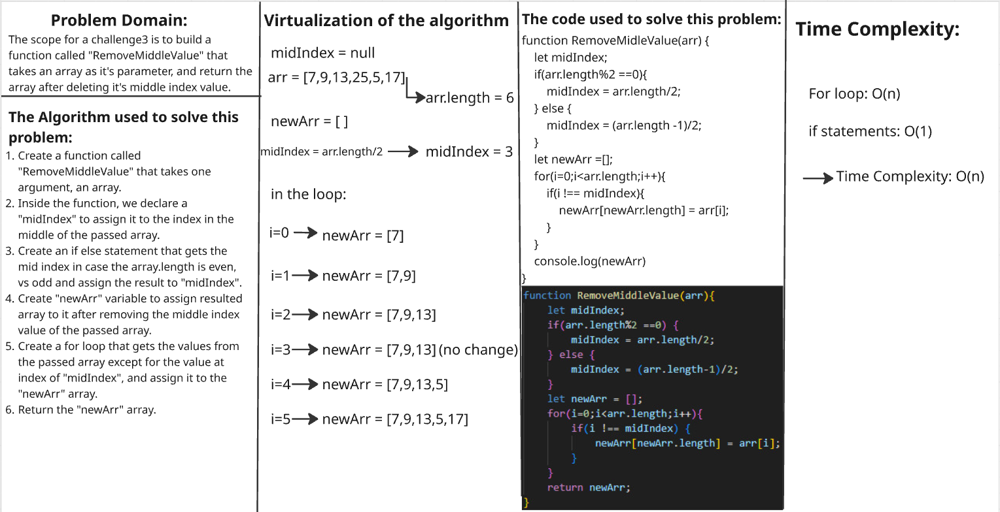

# challenges-and-data-structures

### Challenge 1 A: Array Reversal

### Challenge 1 B: Most Frequent Number

### Challenge 2 B: Most Frequent Number

### Challenge 3: Reverse Characters

### Challenge 3 Console.log results

### Challenge 4 Remove Middle Value

